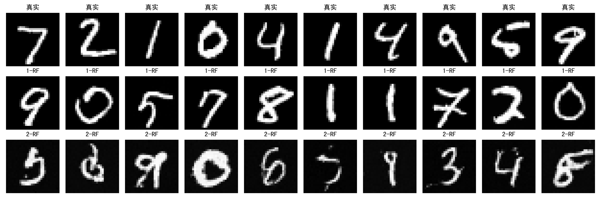

# Rectified Flow - Jupyter Notebook实现

本项目是基于[TongTong313/rectified-flow](https://github.com/TongTong313/rectified-flow)项目的二次开发，旨在将原本复杂的文件结构和命令行操作简化为单个Jupyter Notebook，实现开箱即用的教学和实验环境。

## 项目概述

Rectified Flow是一种新兴的生成模型方法，通过学习从噪声到数据的直线轨迹，实现了高质量的样本生成。本项目提供了完整的1-Rectified Flow和2-Rectified Flow训练与推理流程，特别适合学习和研究生成模型的相关原理。

### 主要特点

- 📓 **单文件实现**：所有功能集成在一个Jupyter Notebook中，便于理解和修改
- 🚀 **开箱即用**：无需复杂的命令行操作，直接线性运行notebook的各单元格即可
- 📚 **教学友好**：代码注释详细，配合中文说明，适合学习使用
- 🔧 **简化配置**：去除复杂的工程优化，专注于算法核心实现
- 💻 **低硬件要求**：MNIST数据集小巧易用，支持消费级显卡训练

## 环境要求

### 主要依赖库版本参考

```
torch                    2.7.1
torchdiffeq              0.2.5
torchmetrics             1.8.2
torchvision              0.22.1
numpy                    2.0.1
matplotlib               3.10.0
opencv-python            4.12.0.88
tqdm                     4.67.1
scipy                    1.15.3
```

### 安装命令

```bash
# 创建并激活conda环境
conda create -n env_name python=3.10
conda activate env_name

# 安装PyTorch（根据你的CUDA版本调整）
pip install torch torchvision torchaudio --index-url https://download.pytorch.org/whl/cu126

# 安装其他依赖
pip install torchdiffeq torchmetrics matplotlib opencv-python tqdm scipy
```

## 项目结构

```
Rectified-flow-notebook/
├── rectified_flow.ipynb     # 主要的notebook文件
├── checkpoints/             # 训练好的模型权重
│   ├── 1rf/                # 1-Rectified Flow模型
│   └── 2rf/                # 2-Rectified Flow模型
├── data/                   # MNIST数据集
├── results/                # 生成的结果图片
│   ├── 1rf/               # 1-RF生成结果
│   ├── 2rf/               # 2-RF生成结果
│   └── comparison.png     # 对比图
└── README.md              # 本文件
```

## 使用说明

### 1. 运行Notebook

打开`rectified_flow.ipynb`，使用env_name中的解释器作为内核，按顺序执行所有单元格即可完成训练和推理。

### 2. 主要功能模块

- **参数设置**：配置训练超参数和模型参数
- **数据加载**：自动下载和加载MNIST数据集
- **模型定义**：MiniUNet网络结构
- **1-Rectified Flow训练**：基础Rectified Flow模型训练
- **2-Rectified Flow训练**：Reflow过程，进一步优化生成轨迹
- **推理和评估**：生成样本并计算IS/FID指标
- **结果可视化**：展示生成效果

## ODE求解器说明

本项目使用`torchdiffeq`库进行ODE求解，这是PyTorch生态中专门用于神经微分方程的库。

### 当前实现
- 使用**欧拉法**进行数值求解
- 固定步数采样（1-RF: 50步，2-RF: 5步）

### 自定义修改建议

开发者可以根据需要修改ODE求解器的配置：

```python
from torchdiffeq import odeint

# 当前实现（欧拉法）
t_span = torch.linspace(0, 1, steps).to(device)
trajectory = odeint(rf.vector_field, x_0, t_span, method='euler')
x_t = trajectory[-1]

# 可选择高阶自适应步数求解器
t = torch.tensor([0.0, 1.0]).to(device)
trajectory = odeint(rf.vector_field, x_0, t, method='dopri5')     # Runge-Kutta 4(5)
trajectory = odeint(rf.vector_field, x_0, t, method='dopri8')     # 8阶Runge-Kutta
trajectory = odeintiffeq(rf.vector_field, x_0, t, method='bosh3') # Bosh 3阶
x_t = trajectory[-1]
```

### 性能权衡
- **欧拉法**：速度快但精度较低，适合快速原型
- **高阶自适应步数方法**：精度高但计算量大，适合高质量生成

## 性能对比
理论上，通过Reflow过程，2-Rectified Flow能够在更少的步数内达到与1-Rectified Flow相当的生成质量，显著提升推理效率。

但由于本人对reflow过程准备的配对数据量似乎较小，且没有精细调优超参数，故2-Rectified Flow在5步下的欧拉法生成结果质量一般。开发者可自行进一步调整超参数并测试性能。

本人实现的对比结果如下：

## 算法原理

### 1-Rectified Flow
1. 从标准正态分布采样噪声 $ z_0 \sim \mathcal{N}(0, I) $
2. 从真实数据采样 $ z_1 \sim p_{data}(x) $
3. 线性插值：$ z_t = (1-t) \cdot z_0 + t \cdot z_1 $
4. 学习向量场：$ v_\theta(z_t, t) = z_1 - z_0 $

### 2-Rectified Flow (Reflow)
1. 使用训练好的1-RF模型生成配对数据
2. 重新训练模型，学习更直的轨迹
3. 实现更少步数的推理

## 致谢

- 本项目基于[TongTong313/rectified-flow](https://github.com/TongTong313/rectified-flow)进行二次开发，感谢原作者童佬提供的详细代码和视频教程
- 核心算法参考论文：
  - [Flow Straight and Fast: Learning to Generate and Transfer Data with Rectified Flow](https://arxiv.org/abs/2209.03003)
  - [Flow Matching for Generative Modeling](https://arxiv.org/abs/2210.02747)

## 许可证

本项目采用 MIT 许可证，详情如下：

```
MIT License

Copyright (c) 2025 Rectified Flow Notebook Contributors

Permission is hereby granted, free of charge, to any person obtaining a copy
of this software and associated documentation files (the "Software"), to deal
in the Software without restriction, including without limitation the rights
to use, copy, modify, merge, publish, distribute, sublicense, and/or sell
copies of the Software, and to permit persons to whom the Software is
furnished to do so, subject to the following conditions:

The above copyright notice and this permission notice shall be included in all
copies or substantial portions of the Software.

THE SOFTWARE IS PROVIDED "AS IS", WITHOUT WARRANTY OF ANY KIND, EXPRESS OR
IMPLIED, INCLUDING BUT NOT LIMITED TO THE WARRANTIES OF MERCHANTABILITY,
FITNESS FOR A PARTICULAR PURPOSE AND NONINFRINGEMENT. IN NO EVENT SHALL THE
AUTHORS OR COPYRIGHT HOLDERS BE LIABLE FOR ANY CLAIM, DAMAGES OR OTHER
LIABILITY, WHETHER IN AN ACTION OF CONTRACT, TORT OR OTHERWISE, ARISING FROM,
OUT OF OR IN CONNECTION WITH THE SOFTWARE OR THE USE OR OTHER DEALINGS IN THE
SOFTWARE.
```

## 贡献

欢迎提交Issue和Pull Request来改进本项目。

---

**注意**：本项目仅供学习和研究使用，如需用于生产环境，请根据实际需求进行优化。
